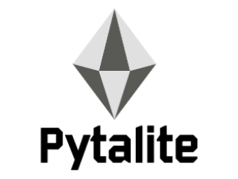
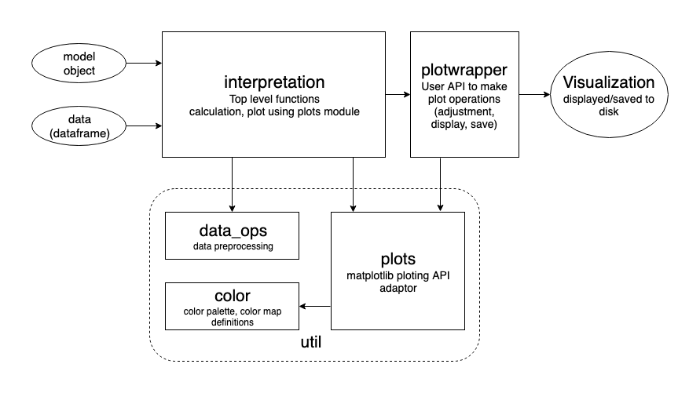
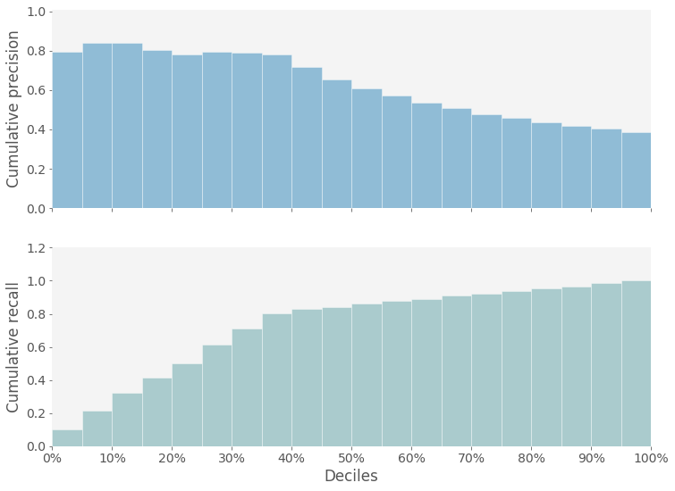
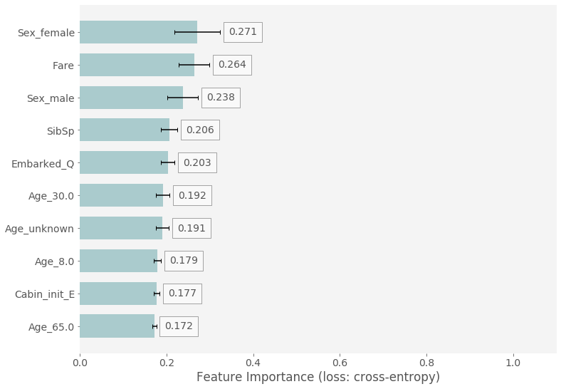
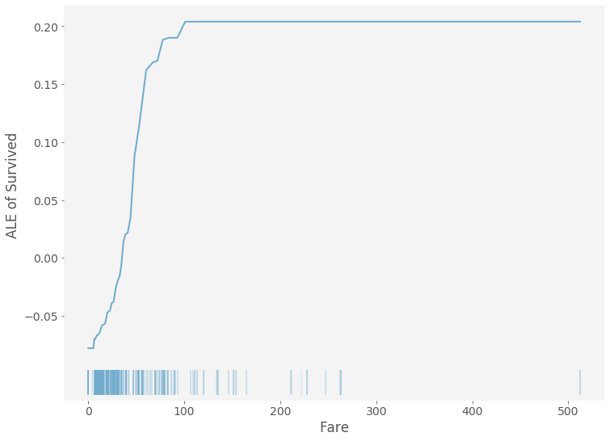

# 
# Pytalite: Model-agnostic diagnostics and evaluation tool for Python and Pyspark

## Overview
Evaluating model performance and diagnosing models are important steps in machine learning model development. Pytalite provides a straightforward wrapper for visualizing model performance and diagnosing machine learning models. It enables users to visualize key snapshots of model performance, e.g. discrete precision-recall curves, probability density plots, model-agnostic feature importance, partial dependence plots, accumulative local effect plots, and feature correlation plots.

## Requirements
Pytalite for python is developed under python 3.7, but is compatible with python 2.7. Pytalite for pyspark is developed to support spark 2.0 and above.

matplotlib &ge; 2.2.x (although 1.4.3 also works, higher version is recommended)

numpy &ge; 1.9.x

scipy &ge; 0.15.x

multiprocess &ge; 0.70.4

## Package Structure

## Highlights
Pytalite provides the following model evaluation and diagnostic algorithms:

- Discrete Precision/Recall Plot (Binary-Classification only)
- Feature Correlation Plot (Binary-Classification only)
- Probability Density Plot (Binary-Classification only)
- Feature Importance Plot (Binary-Classification only)
- Accumulated Local Effect Plot (Binary-Classification / Regression, numerical feature)
- Partial Dependence Plot (Binary-Classification / Regression)

## Examples
See `examples` folder for usage examples.

## Gallery
### Discrete Precision/Recall Plot

---

### Feature Importance Plot

---

### Feature ALE Plot for numerical features

